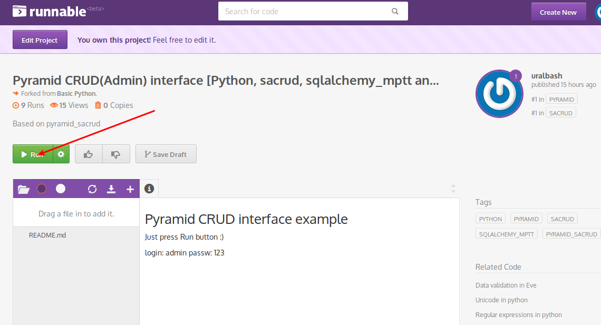
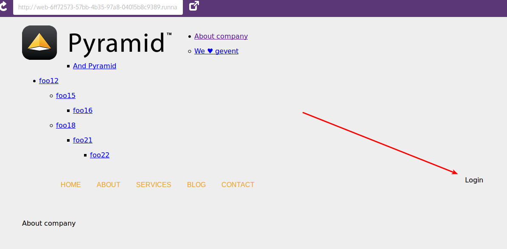
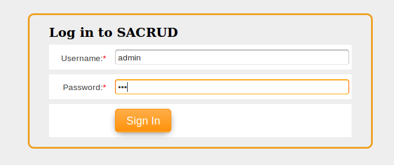
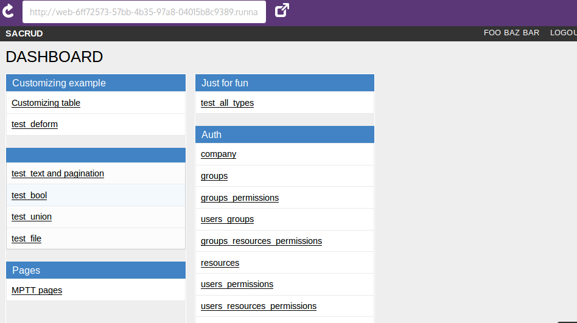
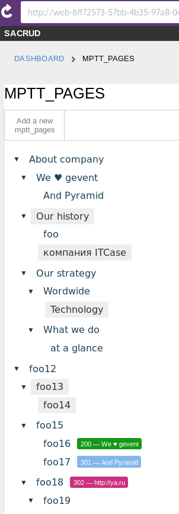

Demo
====

Online on runnable.com
----------------------

Go to `Runnable.com progect <http://runnable.com/VDGfz3HpEe5wCw63/pyramid-crud-admin-interface-for-python-sacrud-sqlalchemy_mptt-and-pyramid_sacrud>`_
and press "▶ Run" button :)

Next go to login

Input login and password.

.. note::
    | Default login anf password is
    |
    | login: admin
    | passd: 123

And see admin interface

Tree pages like django-mptt-pages

