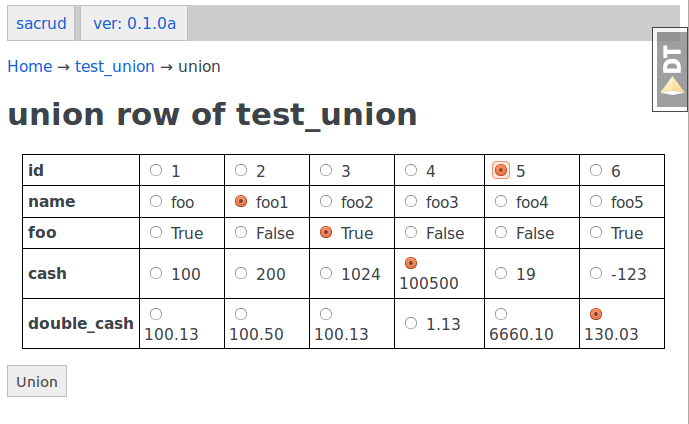

*********************
Install
*********************

**Require:**

* PostgreSQL
* psycopg2
* fortune

Install fortune:

:code:`sudo apt-get install fortune`

.. note::
    For Debian like pkg system.
    
Clone project to local machine:

:code:`git clone git@github.com:uralbash/pyramid_sacrud_example.git`

Edit `development.ini` postgres connection line and create db in PostgreSQL.

Initialize project:

:code:`initialize_example_db development.ini`

Run protject:

:code:`pserve development.ini`

Folow to `<http://localhost:6543/admin/>`_

Screenshot
==========

.. image:: _static/pyramid_hstore.png
.. image:: _static/pyramid_dnd.png

